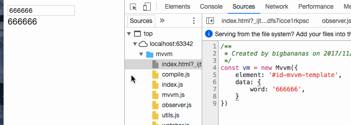

# mvvm

> 一个 mvvm 数据双向绑定框架

### 演示说明：
1. `git clone`
2. `npm install`
3. 编写 `index.html` 模板语法
4. 新建一个 `Mvvm` 实例

### 目前支持的语法：
- dom 节点属性：
    - `g-bind`: 将 mvvm 实例变量绑定到渲染层中
    - `g-text`: 将 mvvm 实例变量渲染带dom节点的 `innerHTML`中
    - `g-model`: 将 mvvm 实例变量**双向**绑定到渲染层中
- 非 dom 节点属性：
    - `{{ }}`: 将双花括号的值与 mvvm 实例绑定,渲染出来

### todo list:
- `g-on` 事件绑定的完善
- `g-for` 列表渲染的完善
